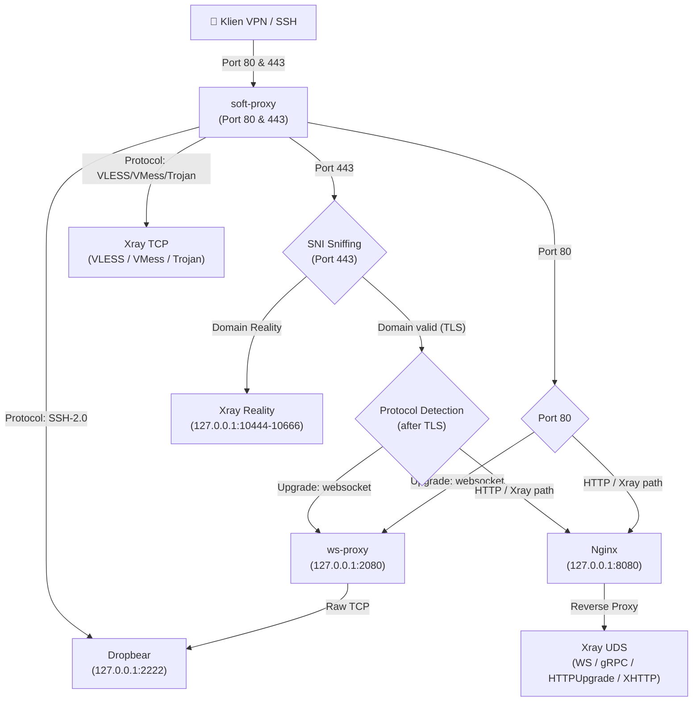

# AutoScript

**AutoScript** adalah installer otomatis untuk server proxy/VPN all-in-one. Menggabungkan Soft-Proxy (multiplexer), Xray-core, Nginx, dan Dropbear dalam satu port (80/443) — siap pakai setelah instalasi.

## Diagram Arsitektur



## Instalasi

```bash
bash <(curl -fsSL https://s3.peli.my.id/install.sh)
```

Masukkan domain yang sudah diarahkan (A record) ke IP VPS.

### Uninstall

```bash
bash <(curl -fsSL https://s3.peli.my.id/uninstall.sh)
```

### Cara mendapatkan Cloudflare API Token (untuk multi/wildcard SSL)

1. Login ke akun Cloudflare
2. **Manage Account** → **Account API Tokens**
3. Klik **Create Token**
4. **Nama token** — bebas sesukamu
5. **Permission Policies** → pilih **Edit zone DNS**
6. **Review Token** → **Create Token**
7. Salin token (contoh: `cfat_xxxxx...`)

> **Minimal sistem:** Ubuntu 22.04+ / Debian 11+ / Linux Mint

## Protokol & Transport

### SSH

| Transport | Port |
|-----------|------|
| SSL/TLS | 443 |
| WebSocket CDN | 80 |
| WebSocket CDN (TLS) | 443 |

### Xray-core

| Protokol | Plain (80) | TLS (443) |
|----------|-----------|-----------|
| VLESS | TCP, WS, HTTPUpgrade, XHTTP | TCP, WS, HTTPUpgrade, XHTTP, gRPC |
| VMess | TCP, WS, HTTPUpgrade, XHTTP | TCP, WS, HTTPUpgrade, XHTTP, gRPC |
| Trojan | TCP, WS, HTTPUpgrade, XHTTP | TCP, WS, HTTPUpgrade, XHTTP, gRPC |

### Reality (port 443, TLS Bypass)

| Variant | VLESS | VMess | Trojan |
|---------|-------|-------|--------|
| XTLS-REALITY | sni: yahoo.com | ❌ | ❌ |
| TCP-REALITY | sni: www.yahoo.com | sni: www.cisco.com | sni: apple.com |
| XHTTP-REALITY | sni: www.google.com | sni: www.speedtest.net | sni: www.icloud.com |
| gRPC-REALITY | sni: openai.com | sni: gitlab.com | sni: docker.com |

## Credits & Version

- **Pembuat / Credit**: superencrypt
- **Versi / Version**: v26.7.10 (Dirilis pada 10 Juli 2026)

## Lisensi

MIT
