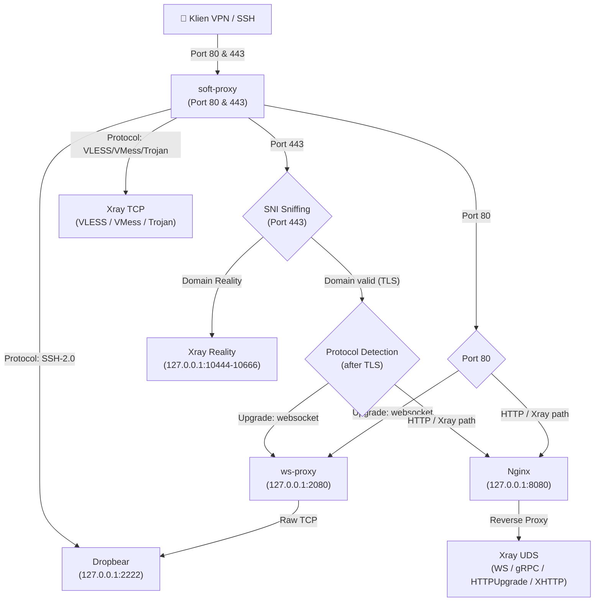

# 🚀 AutoScript: Ultimate VPN & Proxy All-in-One Installer

[](https://github.com/superencrypt-dev/autoscript)
[](https://github.com/superencrypt-dev/autoscript)
[](https://opensource.org/licenses/MIT)

---

## ✨ Fitur Unggulan

* **⚡ Single Port Multiplexing**: Jalankan SSH, VLESS, VMess, dan Trojan secara bersamaan di port `80` dan `443` menggunakan `soft-proxy`.
* **🔒 Xray Reality & TLS Bypass**: Keamanan mutakhir anti-blokir menggunakan Reality TLS bypass dengan fallback SNI ke situs-situs populer (Apple, Yahoo, Google, OpenAI, dll).
* **⏳ Auto-Expiry & Lock System**: Akun akan otomatis dikunci (locked) oleh sistem cron job harian jika melewati masa aktif, dan dapat diperpanjang (renew) interaktif melalui TUI.
* **🛡️ Secure By Default**: Hak akses database akun dienkripsi secara lokal dengan permission `600` dan penulisan konfigurasi menggunakan metode *atomic-write* agar terhindar dari file korup.
* **📈 TUI Dashboard Interaktif**: Kelola akun, pantau pengguna aktif secara real-time, dan cek status layanan langsung dari command-line dengan menu dashboard premium.

---

## 📐 Arsitektur Aliran Data

AutoScript menggunakan deteksi protokol dinamis pada level TLS untuk mengarahkan koneksi ke backend yang tepat secara instan:



---

## 📥 Panduan Instalasi

Cukup jalankan satu perintah di bawah ini pada VPS bersih Anda (Debian 11+ / Ubuntu 22.04+):

```bash
bash <(curl -fsSL https://s3.peli.my.id/install.sh)
```

> **Catatan:** Pastikan domain Anda telah diarahkan (A record) ke IP VPS Anda sebelum memulai instalasi.

### 📤 Uninstall

Jika ingin membersihkan seluruh konfigurasi dan mengembalikan port sistem seperti semula:

```bash
bash <(curl -fsSL https://s3.peli.my.id/uninstall.sh)
```

---

## 🛠️ Protokol & Transport Yang Didukung

### 1. SSH (Dropbear)
| Transport | Port | Keterangan |
| :--- | :---: | :--- |
| **SSL/TLS** | `443` | Koneksi aman terenkripsi TLS |
| **WebSocket CDN** | `80` | Mendukung payload CDN Cloudflare |
| **WebSocket CDN (TLS)** | `443` | Jalur WebSocket CDN terenkripsi |

### 2. Xray-core
| Protokol | Plain (80) | TLS (443) |
| :--- | :---: | :---: |
| **VLESS** | TCP, WS, HTTPUpgrade, XHTTP | TCP, WS, HTTPUpgrade, XHTTP, gRPC |
| **VMess** | TCP, WS, HTTPUpgrade, XHTTP | TCP, WS, HTTPUpgrade, XHTTP, gRPC |
| **Trojan** | TCP, WS, HTTPUpgrade, XHTTP | TCP, WS, HTTPUpgrade, XHTTP, gRPC |

### 3. Reality (TLS Bypass)
| Varian | VLESS | VMess | Trojan |
| :--- | :---: | :---: | :---: |
| **XTLS-REALITY** | sni: `yahoo.com` | ❌ | ❌ |
| **TCP-REALITY** | sni: `www.yahoo.com` | sni: `www.cisco.com` | sni: `apple.com` |
| **XHTTP-REALITY** | sni: `www.google.com` | sni: `www.speedtest.net` | sni: `www.icloud.com` |
| **gRPC-REALITY** | sni: `openai.com` | sni: `gitlab.com` | sni: `docker.com` |

---

<details>
<summary>🔑 <b>Cara Mendapatkan Cloudflare API Token (Klik untuk Membuka)</b></summary>

1. Login ke dasbor Cloudflare Anda.
2. Navigasikan ke **My Profile** → **API Tokens**.
3. Klik tombol **Create Token**.
4. Pilih template **Edit zone DNS** (atau buat custom token dengan izin `Zone - DNS - Edit`).
5. Pada bagian **Zone Resources**, pilih **Include - All zones** (atau pilih domain spesifik Anda).
6. Selesaikan pembuatan token dan salin token tersebut (contoh: `cfat_xxxxx...`).
7. Masukkan token ini ketika ditanyakan saat proses penggantian domain di menu TUI.
</details>

---

## 👥 Credits & Version

- **Pembuat / Credit**: superencrypt
- **Versi / Version**: `v26.7.11-beta1` (Dirilis pada 11 Juli 2026)

## 📄 Lisensi

Proyek ini dilisensikan di bawah Lisensi [MIT](LICENSE).
